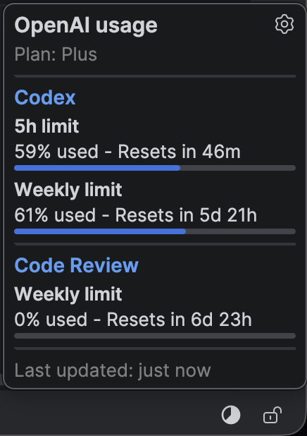
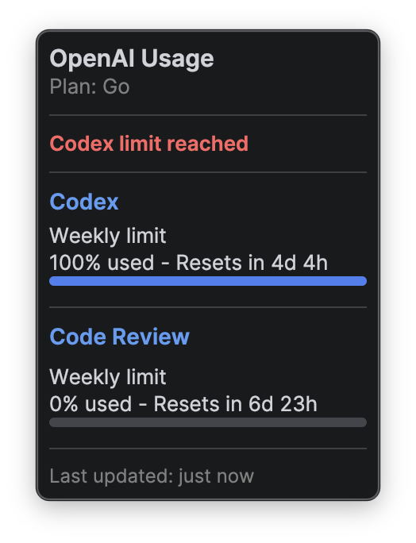
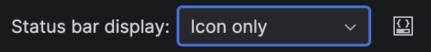
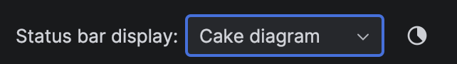
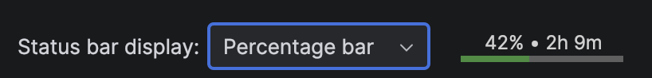
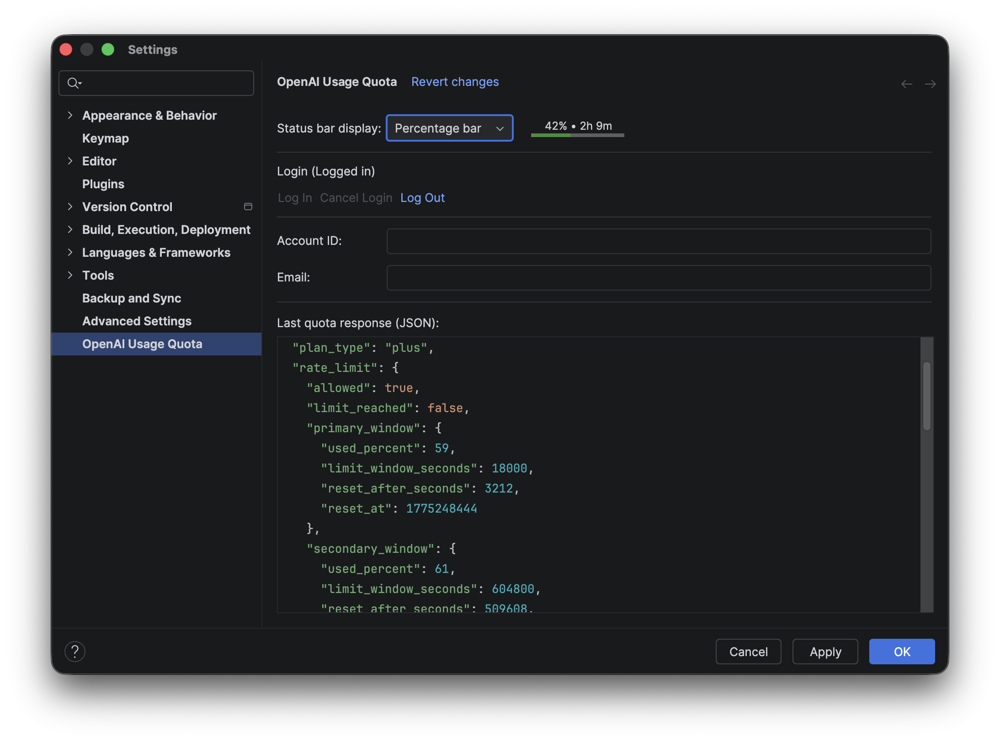

# OpenAI Usage Quota (IntelliJ Plugin)

<p align="center">
  <picture>
    <source media="(prefers-color-scheme: dark)" srcset="src/main/resources/META-INF/pluginIcon_dark.svg">
    <source media="(prefers-color-scheme: light)" srcset="src/main/resources/META-INF/pluginIcon.svg">
    
  </picture>
</p>

An IntelliJ plugin that tracks OpenAI Codex and Code Review usage quotas across OpenAI subscription plans in the status bar and inside a detailed popup.

Install from JetBrains Marketplace: [OpenAI Usage Quota](https://plugins.jetbrains.com/plugin/30690-openai-usage-quota)



## What It Does

- Adds a status bar widget with quick quota state
- Shows a popup with primary/secondary usage windows
- Supports browser-based OAuth login from inside IDE settings
- Stores OAuth credentials in IntelliJ Password Safe
- Automatically refreshes quota data in the background
- Exposes the latest quota data to IDE chat tools via MCP
- Exposes the last raw quota JSON in settings for debugging

## Compatibility

- Built with IntelliJ Platform Gradle Plugin `2.10.4`
- Targets IntelliJ platform build `253` (`sinceBuild = 253`)
- Java toolchain: `21`

In practice, this means IntelliJ IDEA 2025.3+ compatible platform builds.

## Installation

### Option 1: Install From JetBrains Marketplace

1. Open IntelliJ IDEA `Settings` > `Plugins` > `Marketplace`
2. Search for `OpenAI Usage Quota`
3. Click `Install`

### Option 2: Install From ZIP (Local)

Hint: instead of building it yourself, check out the ["Releases"](https://github.com/moritzfl/openai-usage-quota-intellij/releases) section

1. Build the plugin:

```bash
./gradlew buildPlugin
```

2. In IntelliJ IDEA, go to `Settings` > `Plugins` > gear icon > `Install Plugin from Disk...`
3. Select the ZIP from `build/distributions/`

### Option 3: Run in Sandbox (Development)

```bash
./gradlew runIde
```

This opens a sandbox IDE with the plugin loaded.

## Usage

1. Open `Settings` > `OpenAI Usage Quota`
2. Click `Log In`
3. Complete the browser login flow
4. Return to IDE and check:
- Status bar icon tooltip for quick status
- Click widget for a detailed popup
- Settings page for account id/email and last JSON response

Logout is available in the same settings page.

## Screenshots

### Quota Popup




### Status bar







### Chat (MCP integration)


### Settings



## How It Works

### OAuth Login

- Authorization endpoint: `https://auth.openai.com/oauth/authorize`
- Token endpoint: `https://auth.openai.com/oauth/token`
- Redirect URI: `http://localhost:1455/auth/callback`
- Local callback server runs only for the login flow

### Quota Request

The plugin calls:

- `GET https://chatgpt.com/backend-api/wham/usage`

Headers:

- `Authorization: Bearer <access_token>`
- `ChatGPT-Account-Id: <accountId>` (optional, sent if available)

### Refresh Behavior

- Background refresh interval defaults to 5 minutes
- Additional refreshes happen on login and when opening the status popup

## Important Notes

- The quota endpoint appears to be an internal ChatGPT backend API and may change or be restricted.
- If the endpoint schema changes, parsing may fail until the plugin is updated.

## Security / Data Handling

- OAuth credentials are stored via IntelliJ Password Safe
- Logging out clears stored credentials
- Latest quota response JSON is shown in settings for transparency/debugging

## Troubleshooting

### "Port 1455 is already in use"

Another app/process is using the OAuth callback port. Stop that process and retry login.

### "Not logged in"

Open plugin settings and start login flow again.

### Quota fetch errors

If request/response behavior changed on the backend, inspect `Last quota response (JSON)` in settings.
