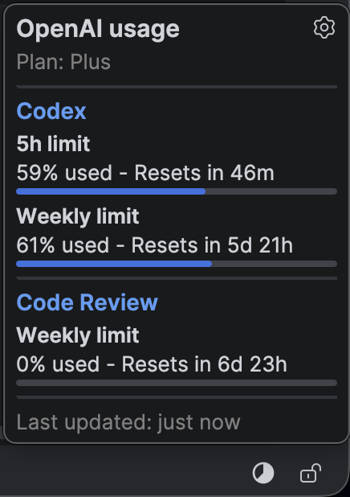
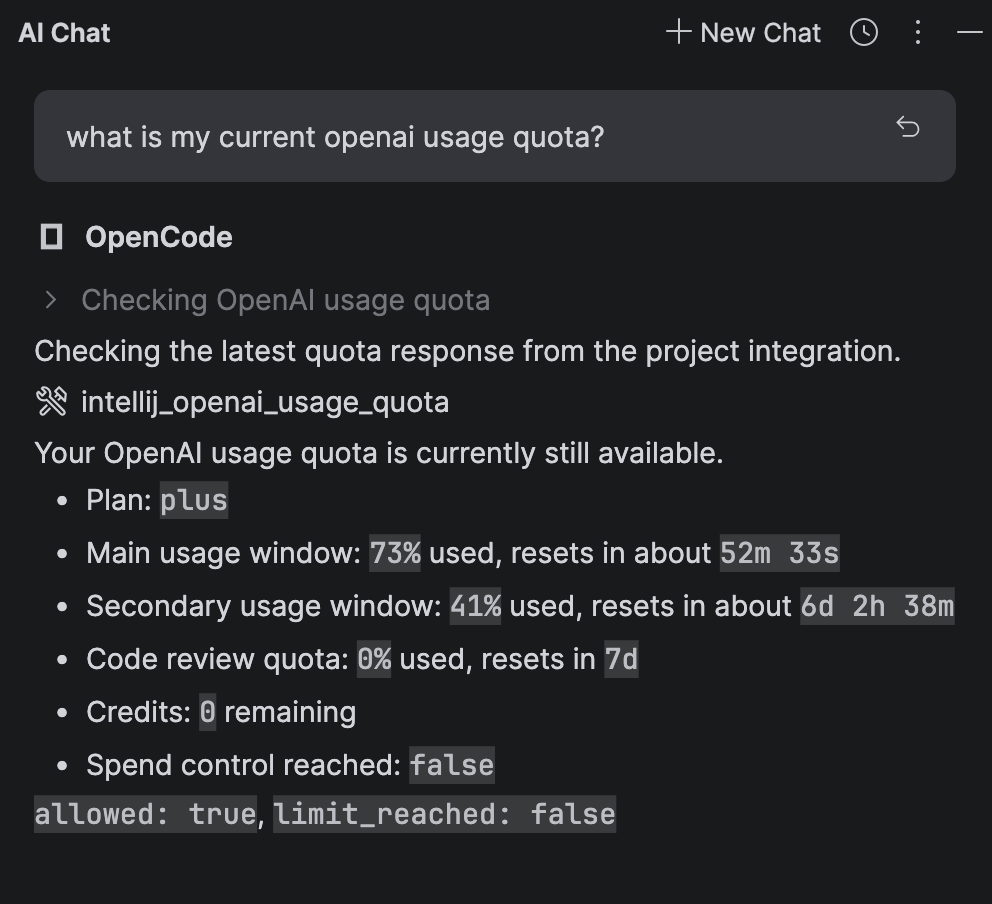
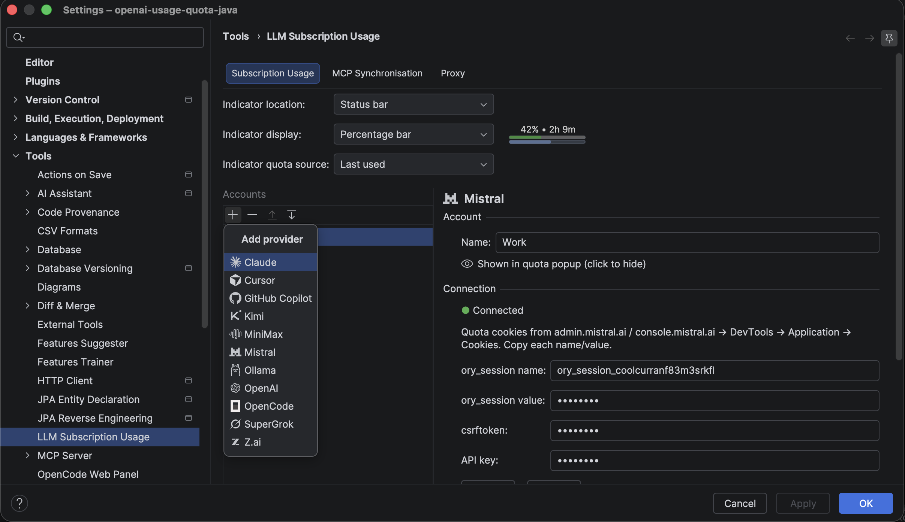

# LLM Subscription Usage

Track and use your LLM subscriptions directly in IntelliJ IDEA.

- **See your quota** for ChatGPT, Claude, Grok, Copilot & more in the status bar and a detail popup.
- **Use your subscriptions from IDE chat** via MCP tools: quota lookup, web search, image and video generation.
- **Reuse your subscriptions in other tools** through a local OpenAI-compatible proxy (for example as a custom LLM provider for JetBrains Junie).
- **Keep AI client configs in sync** with IntelliJ's MCP server URL, which changes port between restarts.

<table align="center">
  <tr>
    <td align="center">
      
       
      <strong><a href="https://plugins.jetbrains.com/plugin/30690-openai-usage-quota">LLM Subscription Usage on JetBrains Marketplace</a></strong>
       
       
      
      
      
    </td>
  </tr>
</table>

## Supported providers

| Provider | Sign-in | Quota | Web search | Images | Video | Proxy |
|---|---|:-:|:-:|:-:|:-:|:-:|
| OpenAI (ChatGPT / Codex) | Browser login | ✓ | ✓ | ✓ | — | ✓ |
| Claude (Anthropic) | Browser login | ✓ | — | — | — | — |
| SuperGrok / xAI | Browser login | ✓ | ✓ | ✓ | ✓ | ✓ |
| GitHub Copilot | Device code | ✓ | — | — | — | ✓ |
| Cursor | Session cookie | ✓ | — | — | — | — |
| OpenCode (Go / Zen) | Session cookie + API key | ✓ | — | — | — | ✓ |
| Ollama Cloud | Session cookie + API key | ✓ | ✓ | — | — | ✓ |
| Z.ai | API key | ✓ | ✓ | — | — | ✓ |
| MiniMax | API key | ✓ | ✓ | — | — | ✓ |
| Kimi | Device code | ✓ | ✓ | — | — | ✓ |

*Web search, images, and video are MCP chat tools backed by your subscription. Proxy = available through the local OpenAI-compatible proxy.*

## Installation

Open IntelliJ IDEA `Settings` > `Plugins` > `Marketplace`, search for **LLM Subscription Usage**, and click Install.

## Quick start

1. Open `Settings` > `Tools` > `LLM Subscription Usage`.
2. Sign in or add credentials for the providers you use.
3. Done — the status bar widget now shows your quota. Click it for the detail popup.

Everything else is optional and lives in the same settings page: MCP tools, MCP server URL sync, and the local proxy.

## Quota tracking

**Status bar widget** — a compact indicator shows your quota at a glance. Hover for a quick summary, click for the full popup. You can also place the indicator in the main toolbar instead.

  

**Detail popup** — all active subscriptions side-by-side with their usage windows, next reset times, and last refresh timestamps. Drag and drop to reorder providers.

Quotas refresh automatically every 5 minutes, plus on login and when opening the popup. Credentials — OAuth tokens, API keys, and session cookies — are stored in IntelliJ Password Safe.

## MCP tools for IDE chat

The plugin registers subscription-backed tools with IntelliJ's built-in MCP server. They are available to the IDE's AI chat — and to any external agent or AI harness that connects to IntelliJ's MCP server (Claude Code, Codex CLI, OpenCode, and others):

| Tool | What it does |
|---|---|
| `subscription_quota` | Current usage for any configured provider |
| `subscription_tools_status` | Which providers and tools are ready to use |
| `codex_web_search` | Web search answered by OpenAI/Codex (context size, live access, domain filters) |
| `supergrok_web_search` | Web search answered by Grok (model selection, domain filters) |
| `subscription_web_search` | Result-list web search via Kimi, Z.ai, MiniMax, or Ollama |
| `subscription_image_generation` | Image generation via OpenAI/Codex or SuperGrok/xAI Imagine, optionally saved to a file |
| `supergrok_video_generation` | Video generation via SuperGrok/xAI Imagine |

Individual tools can be enabled or disabled under `Settings` > `Tools` > `MCP Server` > `Exposed Tools`.

## MCP server URL sync

IntelliJ's built-in MCP server may change its port between restarts, which breaks AI clients (OpenCode, Codex CLI, and others) that store the server URL in their own config files.

The plugin can keep those configs pointed at the active endpoint: enable `Sync IntelliJ MCP server URL to JSON/TOML/YAML files` in settings, pick one or more config files, and select the property to update. The settings page also shows whether IntelliJ's MCP server is running, stopped, disabled, or unavailable.

## OpenAI-compatible proxy

The plugin can run a local proxy that exposes your subscriptions through standard OpenAI-compatible endpoints (`/v1/chat/completions`, `/v1/responses` where supported, `/v1/models`, plus LiteLLM-style `/v1/model/info`). Any tool that speaks the OpenAI API or expects a LiteLLM server can then use your subscriptions. Compatibility is tested with the Junie CLI and with JetBrains' own API Connections for AI features (such as the integrated AI chat).

**Setup:** open the **Proxy** tab in `Settings` > `Tools` > `LLM Subscription Usage`, tick `Enable local subscription proxy`, choose the providers to expose, and apply. Then use `Copy Base URL` and `Copy API Key` to configure your client.

**Good to know:**

- Configure clients with the base URL **without** a `/v1` suffix (for example `http://127.0.0.1:14621`) — clients append `/v1/...` themselves, and all routes also answer unprefixed.
- For JetBrains Junie, add the proxy as a LiteLLM provider with that base URL and the copied API key; available models are discovered automatically.
- The API key is generated locally and stored in IntelliJ Password Safe. Provider credentials never leave the plugin's regular secure storage.
- `Log requests and responses to disk` writes full request/response bodies to a temp folder for debugging. Off by default; logs are pruned automatically (7 days / 2000 files).

The proxy implementation was derived from the initial proxy design of [AIProxyOauth](https://github.com/skanga/AIProxyOauth), adapted to Kotlin and extended for this plugin's multi-provider subscription proxy, broader client compatibility, model discovery, request/response translation, and additional OpenAI-compatible routes.

## How it works

The plugin calls each provider's usage API with your credentials and displays the result in a normalized format. Nothing is sent anywhere except to the providers you configured.

Each provider's settings page shows the raw `Last quota response` exactly as it arrived from the API — useful for transparency, debugging, and bug reports.

## Troubleshooting

**"Port 1455 is already in use"** — another process is using the OpenAI login callback port. Stop it and retry the login.

**"Not logged in"** — open the plugin settings and start the sign-in flow for that provider again.

**Quota fetch errors or wrong numbers** — providers occasionally change their API responses. Check `Last quota response` in the provider's settings page to see what the API actually returned, and please [open an issue](https://github.com/moritzfl/openai-usage-quota-intellij/issues/new/choose) with that response attached (redact anything you consider sensitive first). This is usually all that is needed to fix a parsing problem.
